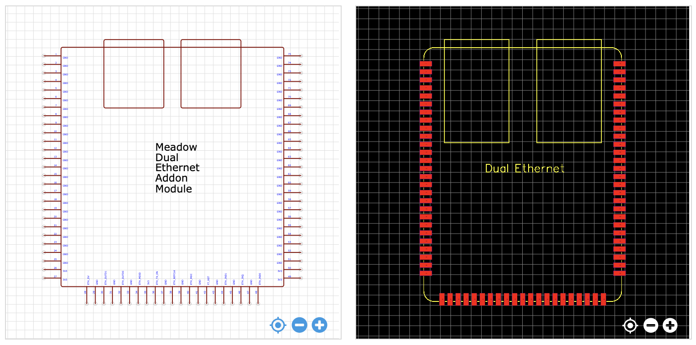
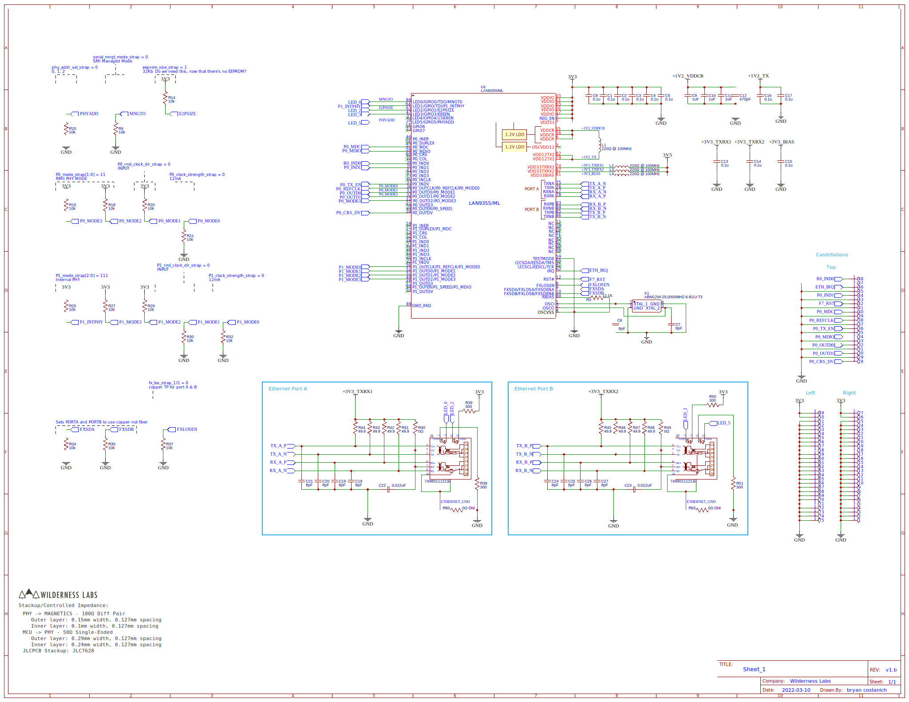

# Dual Ethernet

Provides a dual-port switching ethernet interface for the Core-Compute module.

## Specifications

### EDA Symbol & Footprint

Symbols and footprints have only been created for EasyEDA. We would welcome contributions here!
* **[EasyEDA](https://easyeda.com/component/bbe9f7efc1cd4a0eb8485b15e34fc121**

## Design

