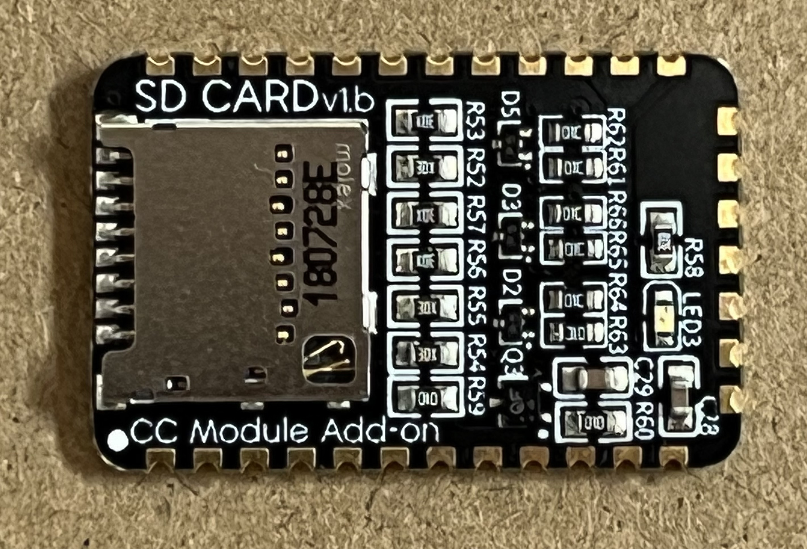
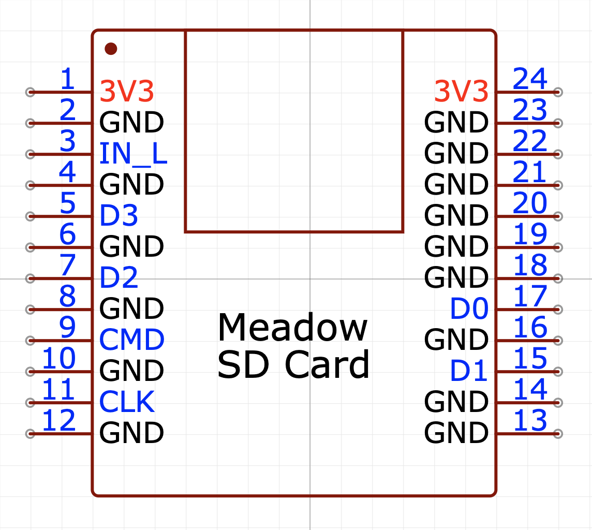
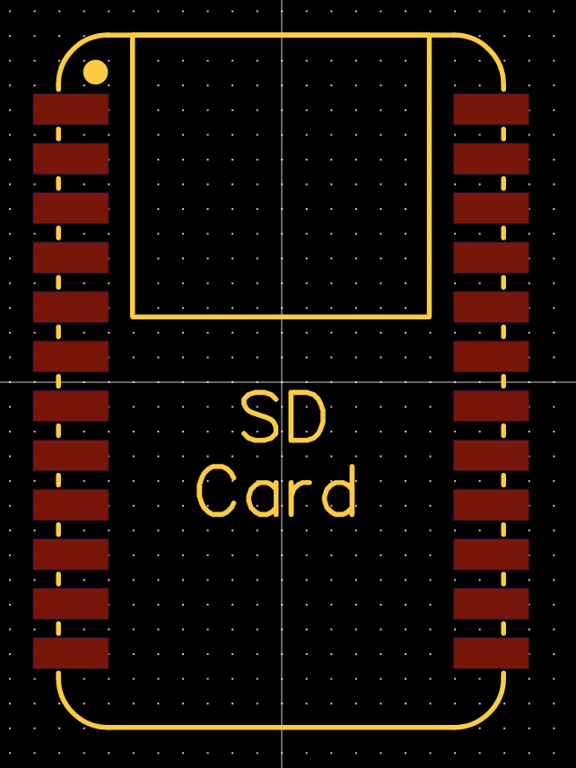
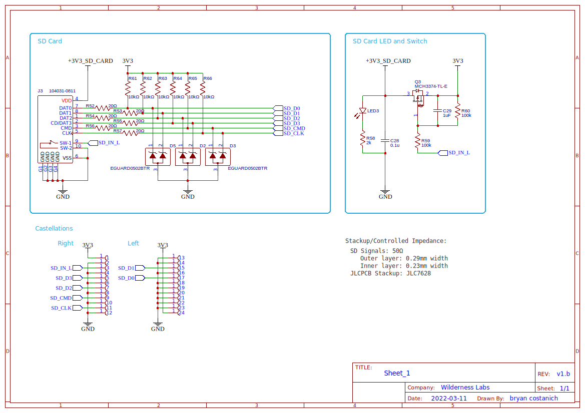
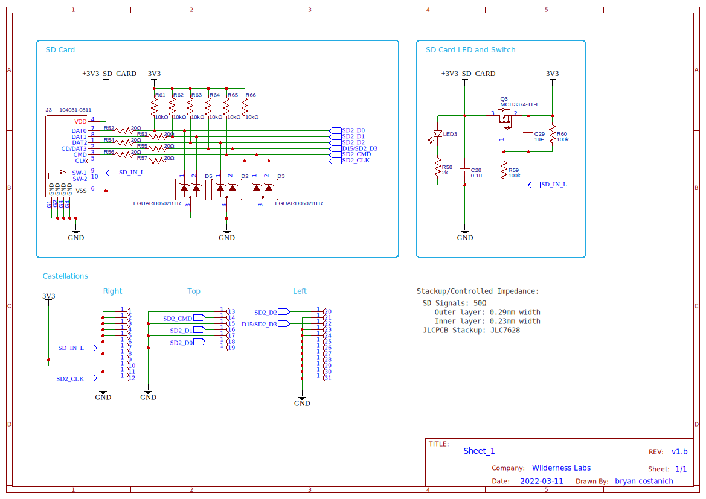

# SD Card

Micro SD-Card addon.

## Specificiations

### EDA Symbol & Footprint

| Symbol | Footprint |
|--------|-----------|
|  |  |

Symbols and footprints have only been created for EasyEDA. We would welcome contributions here!
* **[EasyEDA](https://easyeda.com/component/57e5fa36b2444a3a84e1e210c4eb4410)**

### Pinout

| Pin(s) | Function |
|--------|----------|
| 1, 24 | `3V3`|
| 2, 4, 6, 8, 10, 12-14, 16, 18-23 | `GND` |
| 3 | `SD_IN_L`|
| 5 | `SD_D3` |
| 7 | `SD_D2` |
| 9 | `SD_CMD` |
| 11 | `SD_CLK` |
| 15 | `SD_D1` |
| 17 | `SD_D0` |

### IO

* **`SD_IN_L`** - Connected to the SD switch. When an SD card is inserted, it is pulled low.
* **`SD_CLK`** - SD Card *clock* signal.
* **`SD_CMD`** - SD Card *command* signal.
* **`SD_Dx`** - SD Card *data* lines.

## Release Notes

## v1.c

* Reduced castellations from 3 sides to 2, to lower fabrication cost and make it easier to panelize.
* Initial panel check-in.

## v1.b
 
* Initial design check-in.

## Design
