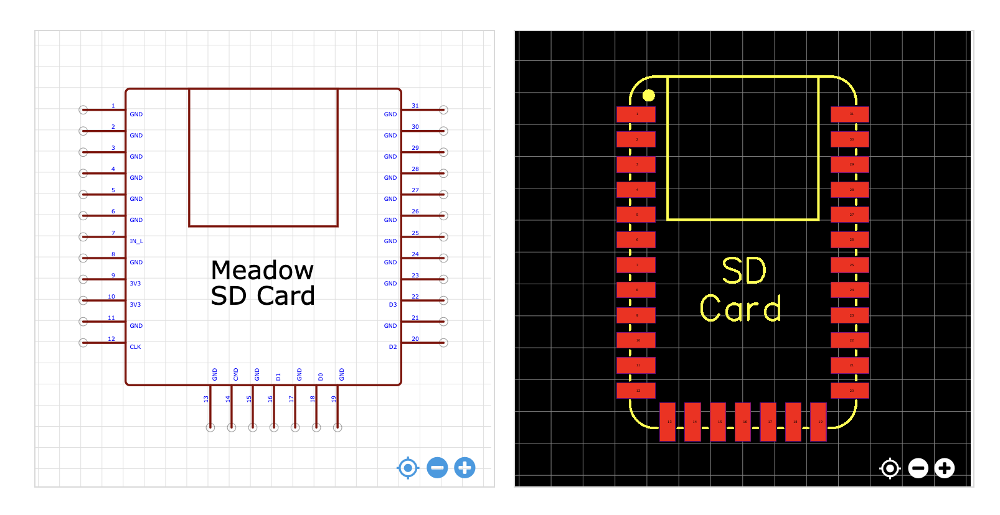

# SD Card

Micro SD-Card addon.

## Specificiations

### EDA Symbol & Footprint

Symbols and footprints have only been created for EasyEDA. We would welcome contributions here!
* **[EasyEDA](https://easyeda.com/component/57e5fa36b2444a3a84e1e210c4eb4410)**

### Pinout

| Pin(s) | Function |
|--------|----------|
| 1-6, 8, 11, 13, 15, 17, 19, 21, 23-31 | `GND` |
| 7 | `SD_IN_L`|
| 12 | `SD_CLK` |
| 14 | `SD_CMD` |
| 16 | `SD_D1` |
| 18 | `SD_D0` |
| 20 | `SD_D2` |
| 22 | `SD_D3` |

### IO

* **`SD_IN_L`** - Connected to the SD switch. When an SD card is inserted, it is pulled low.
* **`SD_CLK`** - SD Card *clock* signal.
* **`SD_CMD`** - SD Card *command* signal.
* **`SD_Dx`** - SD Card *data* lines.

## Design

