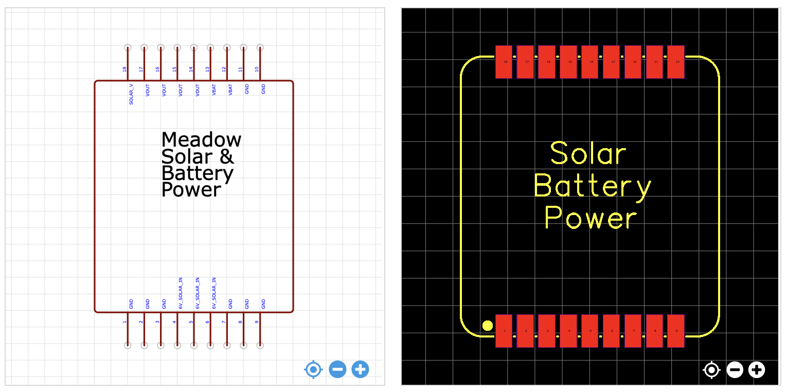

# Solar Power and Battery Charger

Using solar power can be tricky. This module accepts 6V solar panel power input, handles battery charging, and provides a continuous output voltage for operation.

## Specifications

### EDA Symbol & Footprint

Symbols and footprints have only been created for EasyEDA. We would welcome contributions here!
* **[EasyEDA](https://easyeda.com/component/f10842701d354ea69fdb1ca4361015a1)**

### Pinout

| Pin(s) | Function |
|--------|----------|
| 1-3, 7-11 | `GND` |
| 4-6 | `SOLAR_IN` |
| 12-13 | `VBAT` |
| 14-17 | `VOUT` |
| 18 | `SOLAR_V` |

### IO Information

* **`SOLAR_IN`** - Solar power input. Hook this to the positive pole of your solar panel output.
* **`VBAT`** - Battery charging output. Connect this to the positive terminal of your LiPo/LiIon battery.
* **`VOUT`** - Up to `3A` of `4.6V` regulated power. `R11` can be replaced to alter output voltage. See schematic notes for more information. It's just under `5V` to prevent backfeeding into USB power.
* **`SOLAR_V`** - Reference voltage indicating the relative power output of the solar panel. Can be used to measure solar radiation intensity. Voltage divided to output approximately `3.0V` when solar panel is in full sun and clamped so that it will never go above `3.3V`, so it's safe for the analog input ports on the Meadow.

## Design

Using solar power input can be tricky. While low voltage solar panels nominally output `6V`, they can actually output a much higher voltage and will build up high voltage power potential that can damage circuitry when they're plugged in. Additionally, the nature of plugging in solar panels means that you must prevent against voltage spikes.

This design has three major circuits:

* **Voltage Regulator** - The voltage regulator circuit uses a TI `TPS54329E` switching power supply which accepts `4.5V` to `18V` of input, handling the wide varyance of expected voltages from the solar panel, and provides a steady power output which enables much more efficient battery charging, as well as providing a stead power ouptut to the Meadow while the solar panel is in the sun.
* **Battery Charger** - The battery charger circuit uses an `MCP73831T` to provide battery charging functionality and includes a MOSFET (`Q7`) which will shut off the battery output when charging so that voltage regulator provides power from the solar panel while also charging the battery.
* **Solar Voltage Reference** - A voltage divider and voltage suppressing circuit that provides a `3.3V` analog input safe reference signal indicating the intensity of solar radiation.

