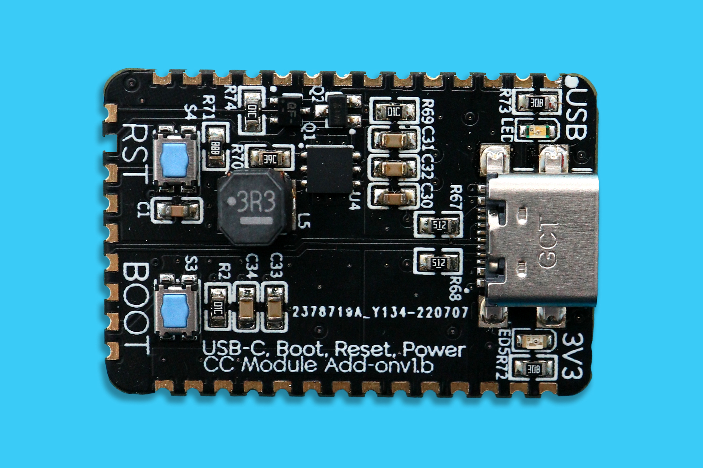
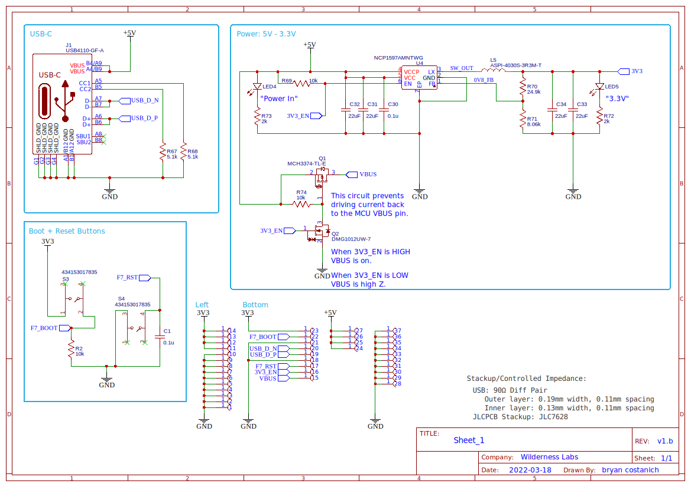

# USB-C, Power, Boot, and Reset

USB-C connectivity for Core-Compute modules. Also includes Boot and Reset buttons, as well as up to `2A` of `3.3V` power, as well as a pass through `5V` USB power.

## Specifications

### Pinout

| Pin(s) | Function |
|--------|----------|
| 1-10   | `GND`    |
| 11-14  | `3V3` Out |
| 15 | `VBUS` |
| 16 | `3V3_EN` |
| 17 | `F7_RST` |
| 18 | `GND` |
| 19 | `USB_D_P` |
| 20 | `USB_D_N` |
| 21 | `GND` |
| 22 | `F7_BOOT` |
| 23 | `3V3` Out |
| 24-27 | `5V` USB Power Out |
| 28-37 | `GND` |

### IO Information

* **`3V3`** - Provides up to `2A` of `3.3V` power from the onboard switching power supply.
* **`VBUS`** - Provides a `5V` reference signal from the USB `5V` rail only when `3V3_EN` is enabled (pulled-high). Connect to the `USB_VBUS` pin on the Core-Compute module.
* **`3V3_EN`** - Enables the `3.3V` switching power supply. Pull to ground to turn disable.
* **`F7_RST`** - Connected to the `RESET` button on the board. Connect to the `F7_RST` IO on the Core-Compute to provide reset via button functionality.
* **`USB_D_P` & `USB_D_N`** - USB differential pairs. Requires a `90Ω` controlled-impedance differential pair to the Core-Compute module.
* **`F7_Boot`** - Connected to the `BOOT` button on the board. Connect to the `F7_Boot` IO on the Core-Compute to provide DFU boot capabiltiies.
* **`5V`** - Direct connection to the `5V` power supply from the USB.

### Power

Includes an `NCP1597AMNTWG` switching power supply that outputs up to `2A` of `3.3V` voltage, as well as passing through `5V` from the USB.

## Design

