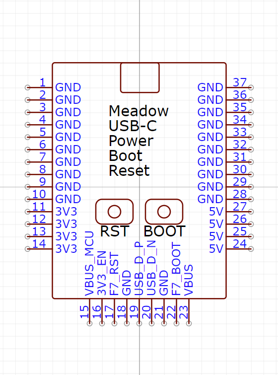
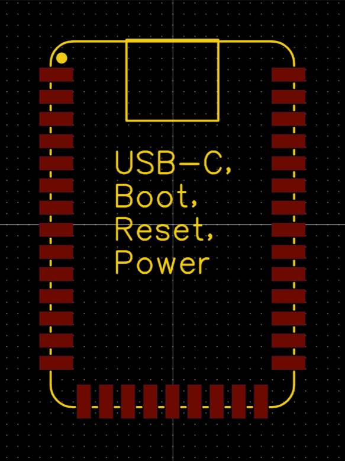
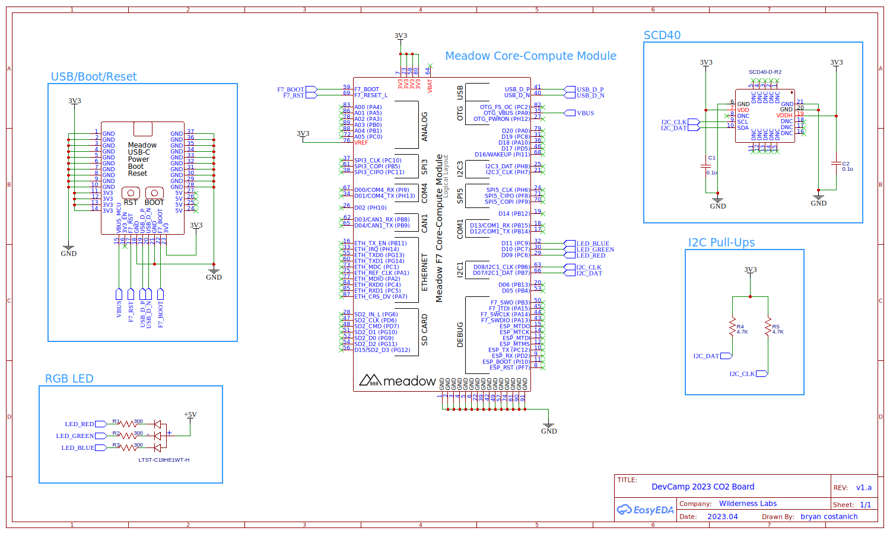
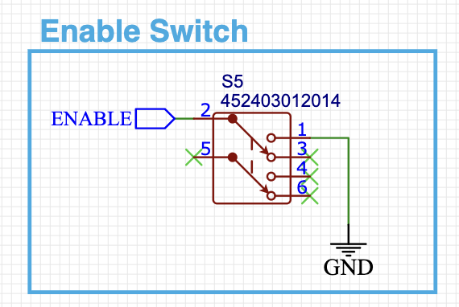
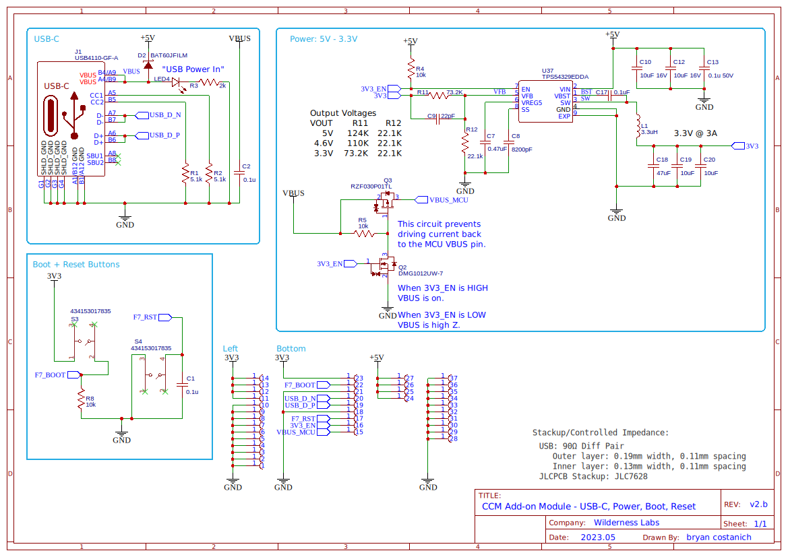

# USB-C, Power, Boot, and Reset

USB-C connectivity for Core-Compute modules. Also includes Boot and Reset buttons, as well as up to `2A` of `3.3V` power, as well as a pass through `5V` USB power.

## Specifications

### EDA Symbol & Footprint

| Symbol | Footprint |
|--------|-----------|
|  |  |

Symbols and footprints have only been created for EasyEDA. We would welcome contributions here!
* **[EasyEDA](https://easyeda.com/component/bb77b894934d4be2804be0e1350d01af)**

### Pinout

| Pin(s) | Function |
|--------|----------|
| 1-10   | `GND`    |
| 11-14  | `3V3` Out |
| 15 | `VBUS` |
| 16 | `3V3_EN` |
| 17 | `F7_RST` |
| 18 | `GND` |
| 19 | `USB_D_P` |
| 20 | `USB_D_N` |
| 21 | `GND` |
| 22 | `F7_BOOT` |
| 23 | `3V3` Out |
| 24-27 | `5V` USB Power Out |
| 28-37 | `GND` |

### IO Information

* **`3V3`** - Provides up to `2A` of `3.3V` power from the onboard switching power supply.
* **`VBUS`** - Provides a `5V` reference signal from the USB `5V` rail only when `3V3_EN` is enabled (pulled-high). Connect to the `USB_VBUS` pin on the Core-Compute module.
* **`3V3_EN`** - Enables the `3.3V` switching power supply. Pull to ground to turn disable.
* **`F7_RST`** - Connected to the `RESET` button on the board. Connect to the `F7_RST` IO on the Core-Compute to provide reset via button functionality.
* **`USB_D_P` & `USB_D_N`** - USB differential pairs. Requires a `90Ω` controlled-impedance differential pair to the Core-Compute module.
* **`F7_Boot`** - Connected to the `BOOT` button on the board. Connect to the `F7_Boot` IO on the Core-Compute to provide DFU boot capabiltiies.
* **`5V`** - Connection to the `5V` power supply from the USB (via a diode).

### Power

Includes an `TPS54329EDDA` switching power supply that outputs up to `3A` of `3.3V` voltage, as well as passing through `5V` from the USB.

### Reference Application

For minimum functionality, please refer to the following reference application:

#### Enable Switch

To use an enable switch with the module, wire up a switch that pulls the `3V3_EN` pin to `GND` in order to turn off:

### Board Schematic

## Release Notes

### v2.b

* Fixed `MCU_VBUS` bug in which an external 5V power source would pull it high.
* Added a power filter cap to USB power.

### v2.a

Updated power supply and MOSFET that had gone obsolete/EoL. 

### v1.d

This revision optimized the layout of the board to move the `BOOT` and `RST` buttons closer to the USB connector so designs that used this could cover the rest of the board. 

### v1.c

This revision changed the design to prevent the 3V3 and 5V diodes from draining power when it was installed on a battery powered board.

* Removed `3V3` LED.
* Added diode to prevent backfeeding to USB.

### v1.b

* Initial check-in
