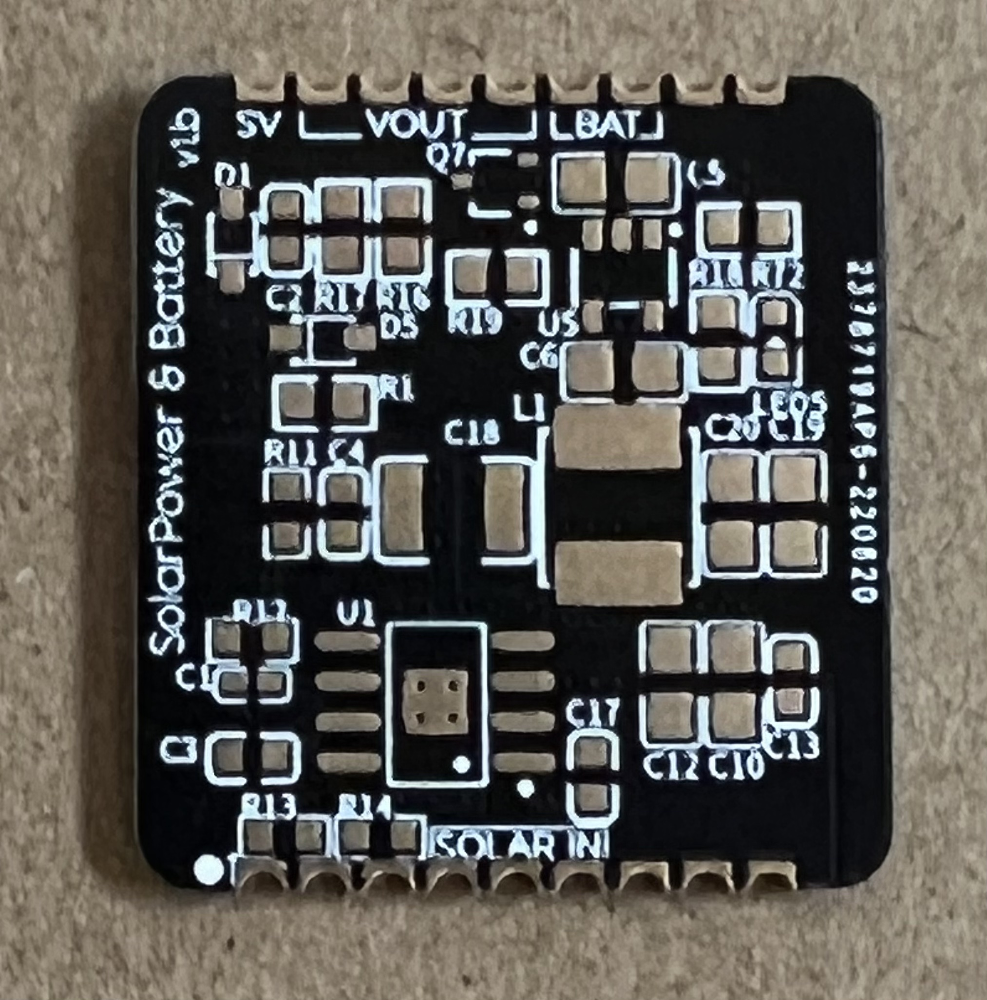
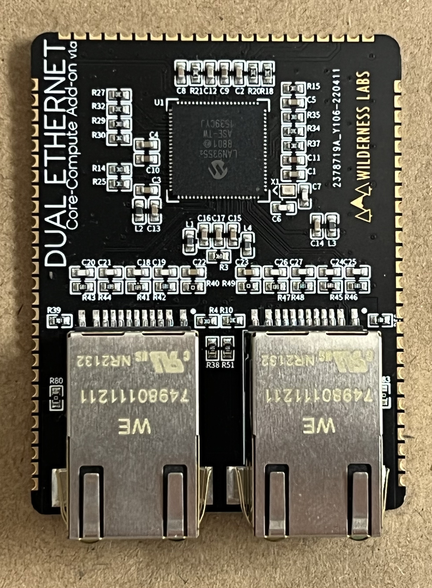
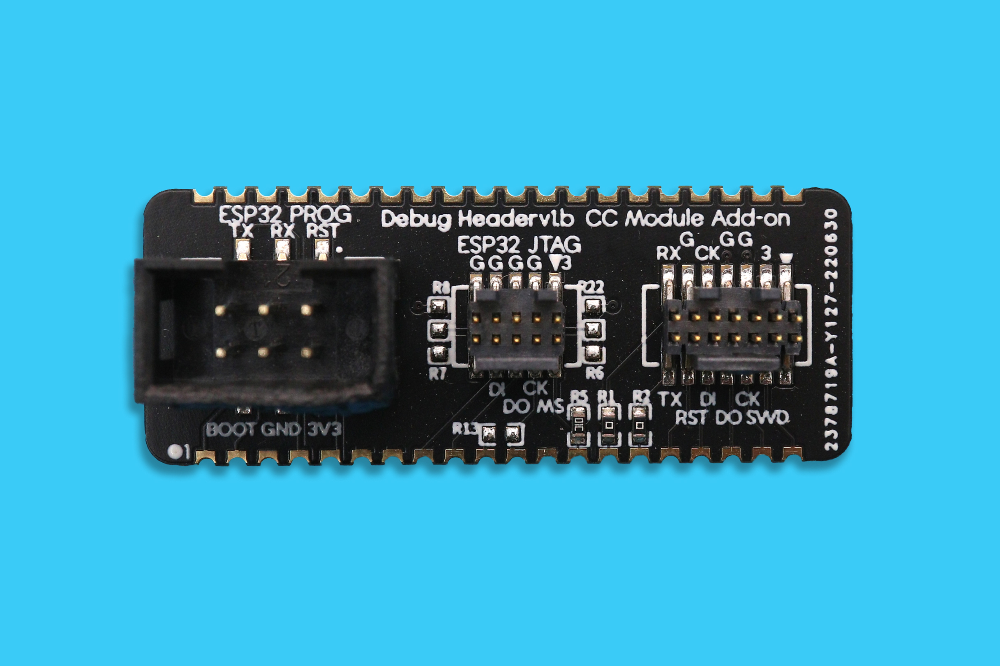

# Hardware Addon Modules

These open source, castellated-SMT addon modules provide discrete hardware functionality needed to support common design patterns when building IoT applications. We have created them to help shorten your time to market by providing composable, drop-in modules that allow you to quickly put together custom hardware for your solutions.

We use these modules in our own designs to reduce manufacturing complexity; by using composable modules, we don't need to integrate each circuit individually into larger designs, instead we just drop in these SMT modules. For example, the Core-Compute dev kit is composed largely of these modules:

## Modules

| Module | Description | Image |
|--------|-------------|-------|
| **[USB-C, Power, Reset](/Docs/USB-C_Power_Boot_Reset/)** | USB-C connectivity for Core-Compute modules. Also includes Boot and Reset buttons, as well as up to `2A` of `3.3V` power, as well as a pass through `5V` USB power. |  |
| **[Solar Power/Battery Charging](/Docs/Solar_Battery_Power/)** | Accepts 6V solar panel power input, handles battery charging, and provides a continuous output voltage for operation. |  |
| **[Dual Ethernet](/Docs/Dual_Ethernet/)** | Provides a dual-port switching ethernet interface for the Core-Compute module. |  |
| **[SD Card](/Docs/SD_Card/)** | Micro SD-Card addon. |  |
| **[Debug Headers](/Docs/Debug_Header/)** | Adds JTAG/SWO for the STM32F7 and ESP32 and UART debug output for the ESP32. |  |

## Purchasing

These module will be available shortly in the Wilderness Labs store.
